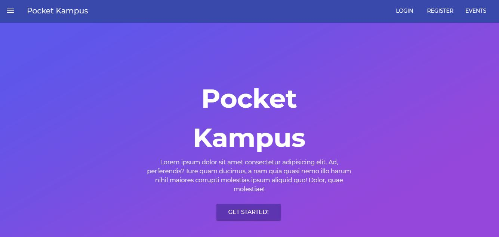

# Pocket Campus

<p align="center">
  <a href="#" rel="noopener">
 </a>
</p>


---

> Managing College Life is now super simple!

---

## Features

- Calendar View
- Reminders
- Subjects : Submissions and Lectures
- Attendance Tracker
- Events Explore Page
- Emails upon Event Registration
- e-Library

---

## Requirements

- Node.js and Node package manager (npm)

---

## Installation & Setup

```sh
$ git clone https://github.com/anushkaparadkar/pocket-campus.git

$ cd client
$ npm i
$ npm run dev

$ cd server
$ npm i
$ node app.js
```

---

## Contributors

- [Anushka Paradkar](https://github.com/anushkaparadkar)
